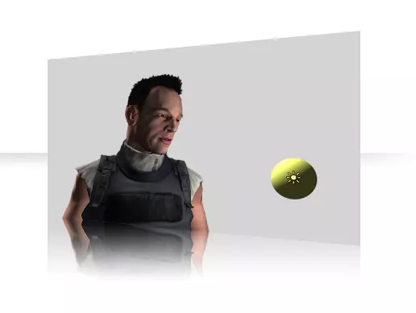
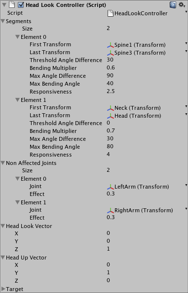

# Head Look Controller (Unity Technologies)

#### Depreciated - Version: 1.04  Jun 22, 2018

No idea why this got depreciated, there was a cull a few months ago (May 2020) where a lot of older assets got removed.
I've used this a few times and it's been a useful asset to modify and learn from so I've made it publicly available here at github.
I've added the unitypackage (better for installation) and the source files here for future reference.

As far as I know this script was originally created by Rune Skovbo Johansen, (July 10, 2009) and a 
[blog post was written here](https://blogs.unity3d.com/2009/07/10/just-looking-around/).

###### Just making characters in your game look around can bring them much more to life as well as express important information to the user. Here we’ll discuss a few use cases and present a script that makes it simple to implement in your game.

First a tech demo video to set the context:

[dead video link]

As can be seen, the looking behavior works regardless of which animations are playing. (One problem though is that when the two hands are holding the gun together, they are not always properly coordinated, but that’s a problem to solve another time!)

######Use Cases
When two characters in a game are talking together (one of which might be a player avatar) they can look at each other to make the interaction look more sincere.

When the avatar comes near a health pack, a weapon that can be picked up, or another important item, he could look at that item. Besides looking natural, this can also make the player more attentive to the item if she hadn’t noticed it herself.

When there’s nothing of particular interest nearby, simply making the character look around at different random points in space looks much more natural than just looking straight ahead. It can also express mood – if the character looks around only at points directly in front, he is probably pretty focused, while if he looks around to the sides and behind him too, he is probably more exploratory or searching around.

Head Look Controller
In between the main things we’re working one here at Unity, we sometimes get to do some projects on the side. In order to make it simple to make a character look at any point in space without requiring extra animations, I have made a head look controller script component as such a side project:

Head Look Controller example project [dead link!]

Head Look Controller (script only) at [Unify Community Wiki](http://www.unifycommunity.com/wiki/index.php?title=HeadLookController)

This script can be used to make a character look towards a specified point in space, smoothly turning towards it with for example the eyes, head, upper body, or whatever is specified. Multiple ranges of bones can be specified, each with different settings for responsiveness, angle constraints etc.

In the video above the controller on the character is set up with one range of bones for the spine and one for the neck and head. Unfortunately the eyes of that character can’t turn, but that could be set up as well with an appropriately rigged character.

Segments should always be specified with the bones/transforms closest to the root specified first and the ones deeper in the skeleton specified after that.

Here’s the settings I used in for the component:

 

I have set the Threshold Angle Difference for the spine to 30, since the spine shouldn’t turn if the target angle (the angle between the direction towards the target and the direction straight ahead) is less than 30 degrees. The Bending Multiplier control how much the segment bends or turns compared to how big the target angle is. The segment will attempt to be no more than Max Angle Difference away from the target angle, though it won’t bend any further once it reaches the Max Bending Angle.

I set the responsiveness of the head segment higher than that of the upper body, since people tend to turn the head quicker. If segments had been specified for the eyes as well, they should have had an even higher responsiveness.

I specified the left and right arm under Non Affected Joints, so that the arms keep keep pointing in the original direction despite the bending and turning of the upper body. By setting the Effect to 0.3 I let them be affected a little bit though.

The Head Look Vector and Head Up Vector are just used for reference to know the default alignment of the head. Per default they are set to forward (0,0,1) and up (0,1,0) respectively.

The Target point that the character should look at is specified through scripting.

“Pro Tips!”
I said above that a character could look around at random points when there’s nothing else to look at. Actually, looking around at a few different points looks more natural in any case. Even when talking to a person or when having found an important object, people rarely tend to stare incessantly at the same point. Introduce more variation by looking at the main point of interest most of the time, but look away at some random points in space now and then.

And if your character supports it, don’t forget to blink once in a while! That is super-easy to do, either with a procedural script or with a traditional animation that only affects the eye-lids and which plays all the time at a higher layer than the other animations. Blinking a bit can really help make a character look less artificial, so if the eyes of a character are ever seen in your game, it’s worth spending the small amount of time it takes to implement.

Go on! Make those characters more believable!
 

